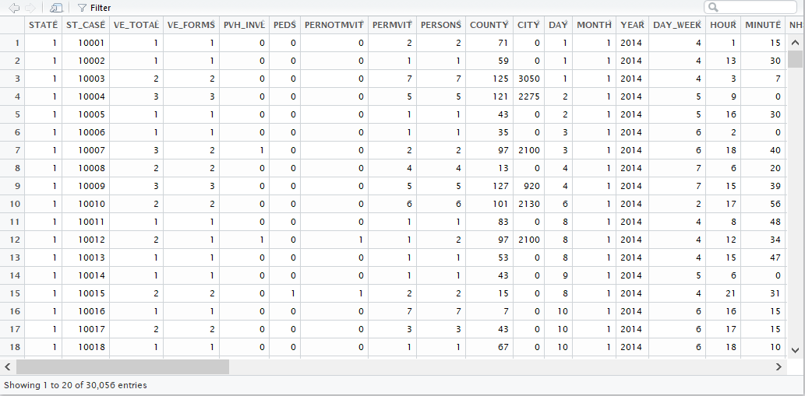
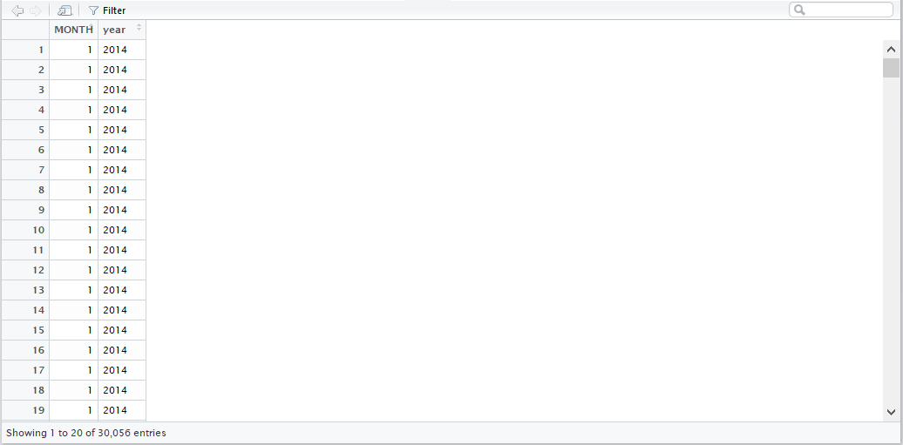
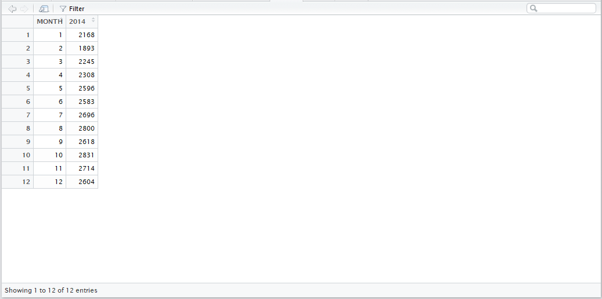
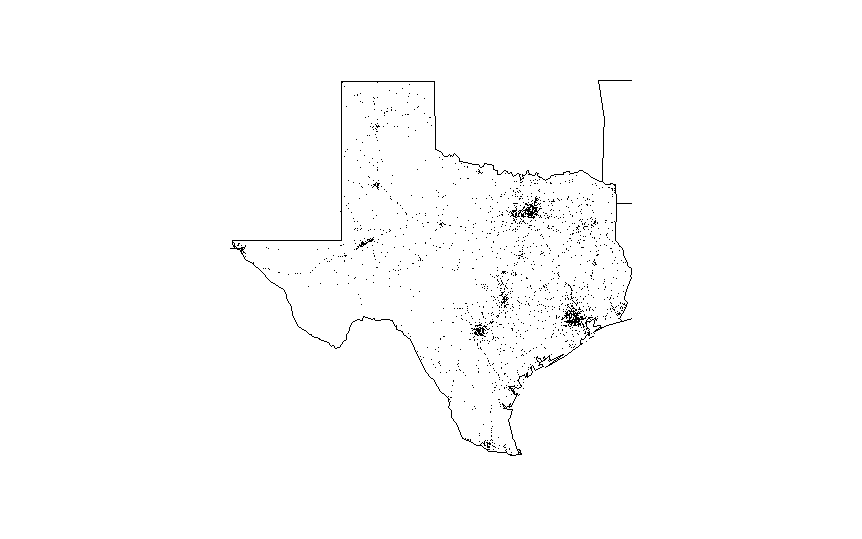
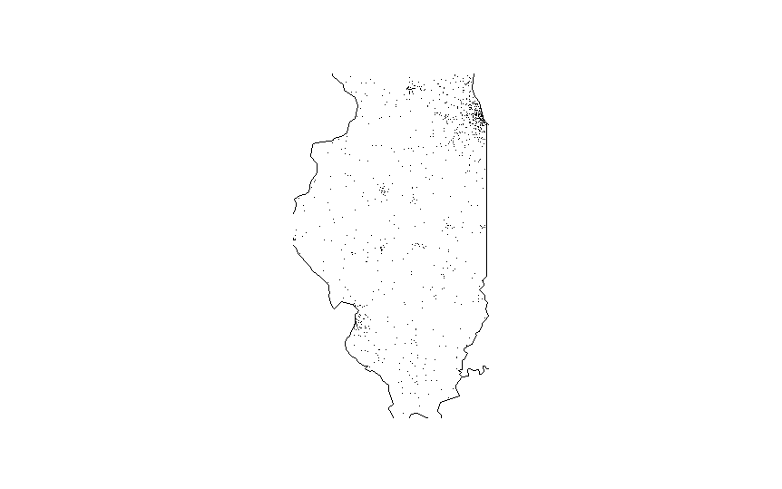

## FARS

This package allows the user to analyze and display data from the US National Highway Traffic Safety Adminstration's [Fatality Analysis Reporting System](http://www.nhtsa.gov/Data/Fatality-Analysis-Reporting-System-(FARS)), a nationwide census providing the American public yearly data regarding fatal injuries suffered in motor vehicle traffic crashes.

Uses the following packages
```{r eval=FALSE}
library(readr)
library(dplyr)
```

## make_filename

This function generates a filename that can be used in the `fars_read` function.  It takes as an input a specific year, and provides as output the full filename as a character string

**Usage**

Example of generating a filename for the 2014 data without having to type in the full filename

```{r eval=FALSE}
file2014 <- make_filename(2014)
file2014
```

```{r eval=TRUE, echo=FALSE}
paste("accident_2014.csv.bz2")
```

## fars_read

This function uses the `readr` package's `read_csv` function to search the Working Directory for a file containing the FARS data to be read.  If the file does not exist, the fucntion alerts the user.  If the file does exist, the data from the file is imported as a data frame using the `dplyr` package's `tbl_df` function.

**Usage**

Example of trying to import data from a file that does not exist
```{r eval=FALSE}
fars_read("accident_2016.csv.bz2")
```

```{r eval=TRUE, echo=FALSE}
paste("file accident_2016.csv.bz2 does not exist")
```

Example of importing the dataset from 2014
```{r eval=FALSE}
data2014 <- fars_read("accident_2014.csv.bz2")
View(data2014)
```


## fars_read_years

This function uses the `mutate` and `select` functions from the `dplyr` package to strip the full data fram associated with a given year, leaving only the rows associated with months and the year.  This provides a matrix of the number of rows of data from a given year, and columns of months, expressed as an integer from 1 to 12, and the year.  If a year for which data is not available is input, this function alerst the user that it is an invalid year.

**Usage**

Example of trying to import data from a file that doesn't exist

```{r eval=FALSE}
fars_read_years(2016)
```

```{r eval=TRUE, echo=FALSE}
paste("Warning message:")
paste("In value[[3L]](cond) : invalid year: 2016")
```

Example of compiling dataset of just months and years from 2014

```{r eval=FALSE}
stripped14 <- fars_read_years(2014)
View(stripped14)
```



## fars_summarize_years

This function returns the total number of incidents per month in a given year.  The only input is the year the user wishes to evaluate, and the `dplyr` package's `bind_rows`, `group_by`, and `summarize` functions and the `tidyr` package's `spread` function are all used to aggregate the individual datapoints into a table of months and incidents per month

**Usage**

Example of fatal accidents per month in 2014

```{r eval=FALSE}
accidents14 <- fars_summarize_years(2014)
View(accidents14)
```


## fars_map_state

This function uses the `maps` package to display dots for each accident on a map of a given state over a given year.  It takes as inputs the state, represented by its number will all states ordered alphabetically, and year.  The `filter` function from the `dplyr` package is used to consolidate the data

**Usage**

This example maps out the fatal accidents in Texas in 2014

```{r eval=FALSE}
fars_map_state(48, 2014)
```


This example maps out the fatal accidents in Illinois in 2013

```{r eval=FALSE}
fars_map_state(17, 2013)
```


